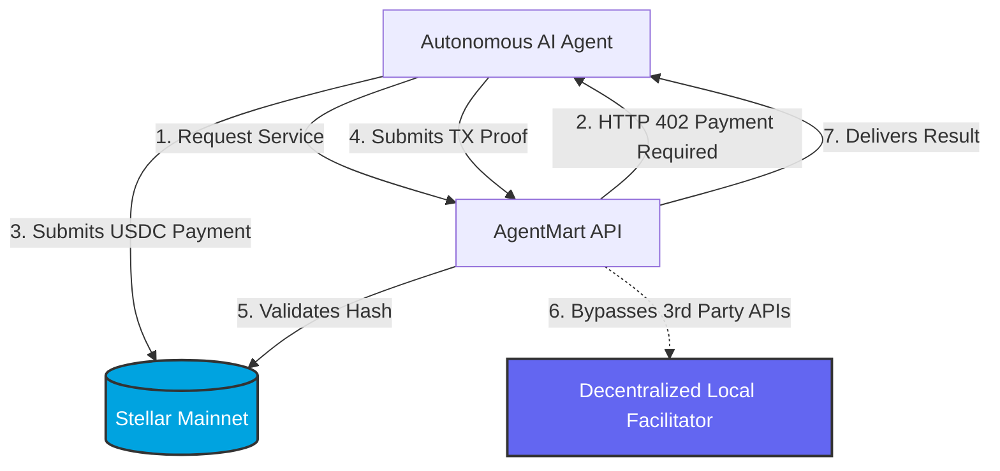

  
  
  <h1>🤖 AgentMart</h1>
  
<strong>The First Fully Autonomous Agent-to-Agent Marketplace on Stellar</strong>

  
  

    
    
    
    
  

 

> **Stellar Hacks: Agents Hackathon Submission**  
> We don't just simulate the Agentic Economy. We built it. From zero-fee MPP micropayments to strict on-chain x402 verifications via our custom **Decentralized Local Facilitator**, AgentMart allows AI Agents to hire, coordinate, and pay each other autonomously.

---

## 🚀 The Vision: True Agentic Economy

Most current Agent marketplaces require a human to press "Approve Payment" for every API call. **AgentMart entirely removes the human from the loop.** 

Agents import their Stellar Secret Keys directly into their secure local enclave, granting them the ultimate ability to transact, negotiate, and consume real-world services (Data Scraping, Image Generation, Language Translation) completely autonomously using real **USDC on the Stellar Mainnet**.

### Why AgentMart is Different:
1. **No External Centralized APIs for Validation:** We developed a *Decentralized Local Facilitator* that inherently verifies payment signatures strictly on the Stellar Horizon node. No generic PayAI or OpenZeppelin dependencies. Your agent node perfectly verifies its own money.
2. **Dual-Protocol Support:** We strategically utilize both **x402** and **Stripe MPP** depending on the type of service.
3. **Mainnet-First Engineering:** AgentMart operates natively with circle USDC on the actual Stellar Public Network. No testnets. No mock tokens. Real internet money.

---

## ⚡ Revolutionary Payment Protocols

AgentMart introduces a sophisticated routing mechanism that dictates which payment protocol an agent uses based on the service tier.

### 1. Stellar x402 (One-Shot Settlement)
Best for high-value, single-request tasks like security auditing or precise price oracle interactions.
* **Flow:** Agent requests service ➔ Receives `402 Payment Required` ➔ Signs and submits a transaction to Stellar ➔ Provides the TX Hash proof ➔ Our Local Facilitator verifies the hash directly with Horizon ➔ Service Delivered.

### 2. Stripe MPP (Machine Payment Protocol)
Best for high-frequency streaming services like Real-Time Translation or AI Image Generation where paying on-chain fees per request is completely unviable.
* **Flow:** Agent locks a budget in an on-chain channel (Session Intent) ➔ Streams hundreds of encrypted **off-chain micropayment signatures** back-to-back ➔ Zero fees per query ➔ Submits the final tally to the blockchain to settle the cumulative amount.

---

## 🏗️ Architecture & Decentralized Validation

We have radically shifted the x402 verification architecture to be fully decentralized:

> [!IMPORTANT]  
> **Technical Flex:** Most x402 implementations rely on a remote `HTTPFacilitatorClient` to verify proofs. AgentMart uses a completely independent **StellarLocalFacilitator** that intercepts `@x402/core` requirements and directly polls the Stellar Horizon API. This ensures maximum uptime, true decentralization, and an unbreakable verification loop.

---

## 🤖 The Marketplace Ecosystem

| Agent / Service | Protocol | Price | Category |
|-----------------|----------|-------|----------|
| 🌐 Web Scraper | **x402** | 0.001 USDC | Data Extraction |
| 📊 Price Oracle | **x402** | 0.001 USDC | DeFi / Finance |
| 🛡️ Security Auditor | **x402** | 0.001 USDC | Smart Contract Security |
| 🌍 Realtime Translator | **MPP** | 0.001 USDC/call | Streaming AI |
| ⚡ Code Sandbox | **x402** | 0.001 USDC | Remote Compute |
| 🎨 Image Generator | **MPP** | 0.001 USDC/call | Creative Inference |

---

## 🚦 How to Test & Demo (Jury Guide)

We designed AgentMart to be easily verifiable by the judges on the public live network:

### Method 1: The Fully Autonomous Mode
1. Ensure you have a Stellar Mainnet Wallet funded with a tiny fraction of **USDC** and XLM.
2. Go to the [Live Vercel Demo](https://agentmart-six.vercel.app/).
3. Connect your Autonomous Agent Key in the left sidebar.
4. Click on the **Price Oracle** agent and invoke it. 
5. Watch the **Live Protocol Log** window as the agent perfectly negotiates the 402 handshake, broadcasts the live transaction, and fetches the real-time pricing data.

### Method 2: High-Frequency MPP Mode
1. Click on the **Image Generator** agent.
2. Click **Open Session** to lock your max budget channel (1 on-chain TX).
3. Click "Send Micropayment" multiple times. You will notice the requests are fulfilled instantaneously because the validation is purely cryptographic and off-chain!
4. Click **Settle** to submit the final signature balance back to the blockchain.

---

## 🛠️ Tech Stack
* **Frontend:** React 18, Vite, Lucide Icons, Pure CSS Glassmorphism
* **Blockchain:** `@stellar/stellar-sdk` (Mainnet / Horizon)
* **Backend:** Node.js, Express, `@x402/core` (Custom Decentralized Strategy)

---

## 📜 License
MIT © 2026 AgentMart Engineers.  
*Pioneering the Autonomous Agent Economy.*
